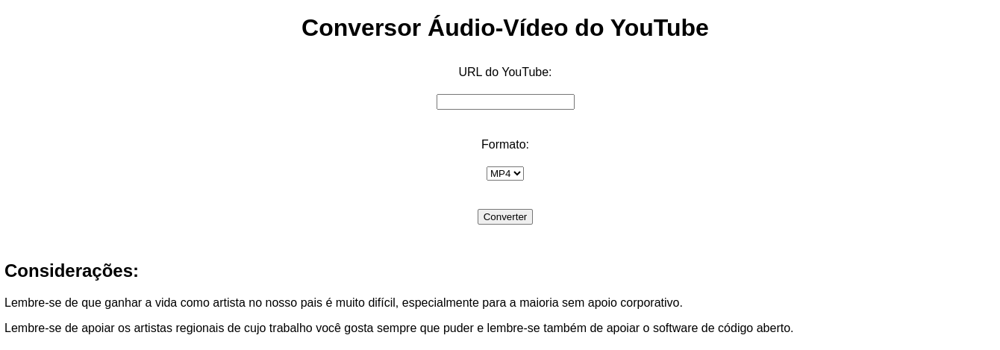

# Pydowntube-AudioVideo
Simples Web App capaz de baixar e converter audio e video a partir do youtube criado com FastAPI 

## Rodar o Projeto

```shell
git clone https://github.com/vladetec/pydowntube-audiovideo.git
cd pydowntube-audiovideo
python3 -m venv venv
source venv/bin/activate
pip install -U pip setuptools wheel 
pip install -r requirements.txt
python run.py 

```
### Exemplo Visual

